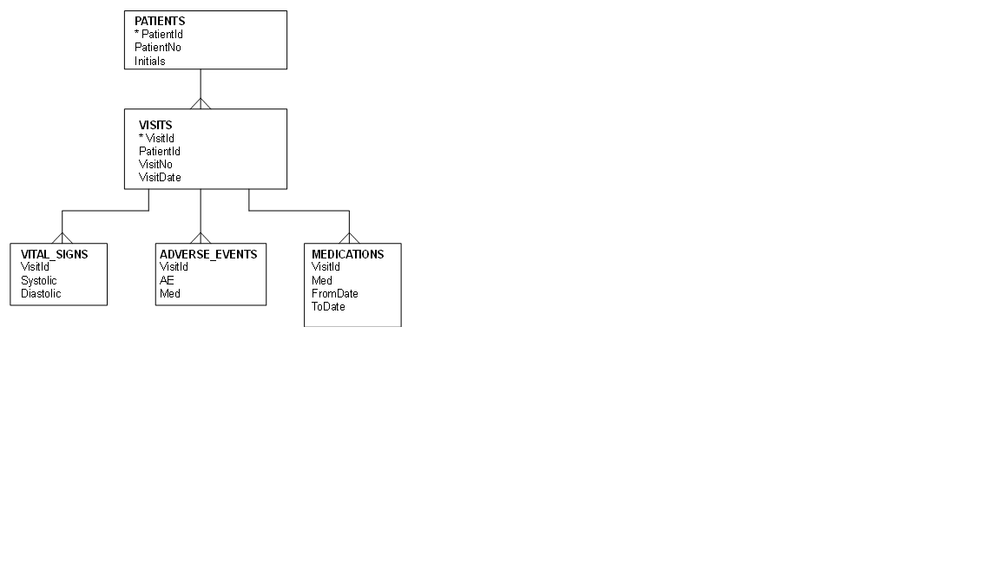
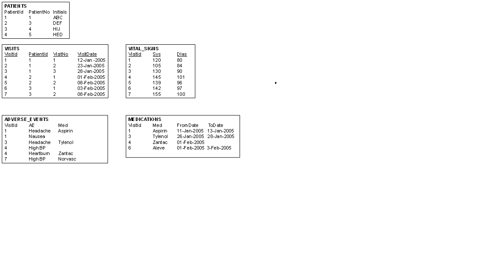
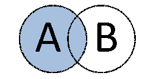
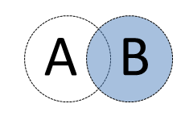
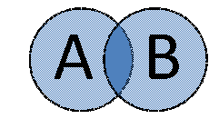
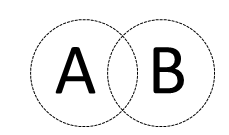
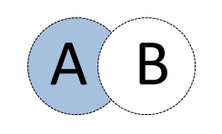

**Entity Model**

**Example Data**

**\
**

1.  List the patients that have never visited a doctor:

2.  Produce the following report, showing for ALL patients each adverse
    event and the details of the medication taken for that adverse
    event. Include ALL adverse events, even those for which no
    medication was taken.

    [PatientNo] [AE] [Med] [FromDate] [ToDate]

3.  List all patients who had a headache more than once:

4.  Produce a report showing the number of days between successive
    visits. Leave the column blank for the first visit for each patient.
    The results should be as follows:
 
 |PatientNo | VisitNo | VisitDate | DaysSincePrevious| 
 |----------|---------|-----------|------------------|
 |1         | 1       | 12-Jan-2005 |                |
 |1 | 2 | 23-Jan-2005 | 11 |
 |  |   |             |    |
 |1 | 3 | 28-Jan-2005 | 5  |
 |  |   |             |    |
 |2 | 1 | 01-Feb-2005 |    |
 |  |   |             |    |
 |2 | 2 | 08-Feb-2005 | 7  |
 |  |   |             |    |
 |3 | 1 | 03-Feb-2005 |    |
 |  |   |             |    |
 |3 | 2 | 08-Feb-2005 | 5  |
 
  

5.  Join the tables to get:

6.  Correct the following SQL query in order to improve its performance:

select distinct p.PatientNo, ae.Med

from Adverse\_Events ae

right join Visits v on v.VisitId = ae.VisitId

inner join Patients p on p.PatientId = v.PatientId

where VisitDate = \'12-Jan-2005\'

or VisitDate = \'23-Jan-2005\'

or VisitDate = \'28-Jan-2005\'

union

select distinct p.PatientNo, ae.Med

from Patients p

left join Visits v on v.PatientId = p.PatientId

left join Medications m on m.VisitId = v.VisitId

where upper(left(p.Initials,2)) = \'AB\'

and m.VisitId in (select VisitId from Vital\_Signs where Sys \> 140)
